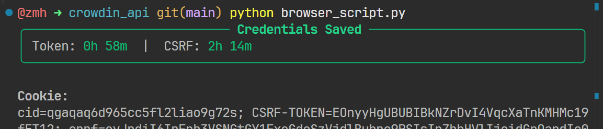
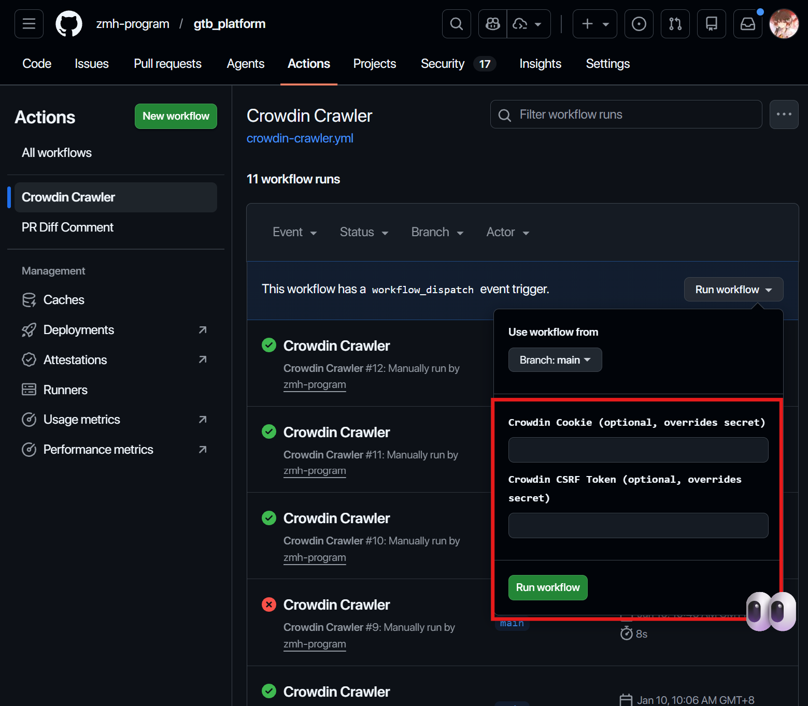

# Crowdin API Maintainers Guide

> **DISCLAIMER**
>
> THIS PROJECT **MAY VIOLATE CROWDIN'S TERMS OF SERVICE**. IT IS PROVIDED STRICTLY FOR TESTING AND RESEARCH PURPOSES.
>
> THE AUTHOR ASSUMES **NO RESPONSIBILITY FOR POTENTIAL ACCOUNT KICKS, BANS, RISK CONTROLS, SUSPENSIONS, OR ANY OTHER RISKS**.
>
> THE PROJECT IS PROVIDED "AS IS", WITHOUT WARRANTY OF ANY KIND. USE AT YOUR OWN RISK. IN NO EVENT SHALL THE AUTHOR BE LIABLE FOR ANY CLAIM, DAMAGES, LEGAL ACTIONS, OR OTHER LIABILITY ARISING FROM THE USE OF THIS PROJECT.

`crowdin_api/` is the core data pipeline for this project's GTB translation database.

It is used to:

1. Fetch GTB theme translations from Crowdin (using a logged-in browser session)
2. Filter and normalize the data
3. Build shortcut and multiword metadata
4. Generate data used by the frontend and APIs such as GTU ([Modrinth page](https://modrinth.com/mod/guesstheutils))

## For Maintainers

### 1. Sync the GTB Database

> Please ensure you have joined the `Simplified Chinese` translation group for the [Hypixel Translation Team](https://crowdin.com/project/hypixel) on Crowdin.
>
> This script requires an existing language translation group to retrieve data for all languages. In theory, another language group could work, but `conf/config.json` currently hardcodes `meta_language_id = 55` (Simplified Chinese) for stability across maintainers.
>
> If you have not joined the translation team yet, register on Crowdin and apply to the Hypixel Simplified Chinese Translation Team (approval typically takes 1-5 days).
>
> If your existing account contains important data/value, use an alternate account for running this script.

### Step 1. Capture Crowdin Session Credentials (Cookie + CSRF)

#### Before Running the Browser Script

```bash
cd crowdin_api
pip install -r requirements.txt
python -m playwright install chromium
```

#### Run

```bash
python browser_script.py
```

What the script does:

1. Opens a browser automatically (tries local Chrome first)
2. Navigates to [crowdin.com](https://crowdin.com/) (can be overridden)
3. Waits for you to log in manually
4. Closes the browser after login is detected
5. Extracts Crowdin `Cookie` and `csrf_token`, then prints them in the terminal



#### Manual Fallback (If the Script Fails)

If the script fails and you cannot fix it quickly, you can extract credentials manually:

1. Open browser DevTools (`F12`) after logging in to [crowdin.com](https://crowdin.com/)
2. Go to the `Network` tab
3. Find a Fetch/XHR request containing `/backend`
4. In `Headers -> Request Headers`, copy:
   - `Cookie`
   - `X-Csrf-Token`
5. If they are missing in one request, check another `/backend` request

### Step 2. Run GitHub Actions

Workflow page:

[GitHub Actions workflow: crowdin-crawler.yml](https://github.com/zmh-program/gtb_platform/actions/workflows/crowdin-crawler.yml)

Instructions:

1. Open the workflow page above
2. Click `Run workflow` on the right
3. Paste the `Cookie` and `CSRF token` captured in Step 1
4. Trigger the run

This workflow will fetch data, run analysis, and create a Pull Request automatically.



### Step 3. Review and Merge the Pull Request

Pull Requests page:

[Pull Requests page](https://github.com/zmh-program/gtb_platform/pulls)

Review checklist:

1. Open the PR generated by the workflow
2. Review the data changes
3. Check the bot-generated SC/MW change summary comment
4. Merge the PR using the expected commit format

After merge, the database is up to date.

### 2. Maintain Config / Data Rules

#### `conf/themes.json`

- GTB theme whitelist
- Only themes listed here are kept in final output (case-insensitive match in analysis)

#### `conf/exclude.json`

- Excludes duplicate or invalid Crowdin keys after filtering with `conf/themes.json`
- Used for edge cases such as duplicate keys differing only by case (for example, `Palm Tree` vs `Palm tree`)
- Ensures final output remains stable and contains only valid GTB themes

#### `conf/completions.json`

- Manual completion / alias mapping (injected as pseudo-language `co`)
- Example entries:
  - `"vr": ["Virtual Reality"]`
  - `"bbq": ["Barbeque"]`

#### `conf/polyfill.json`

- Multiword analysis patch data
- Helps multiword detection for special language cases
- Typically used for languages that no longer exist in Crowdin (for example, Greek) but still exist in actual GTB behavior/data

## For Nerds

> **Just read my code directly.**

### Config Folder (`conf/`)

#### `conf/config.json` (Usually does not need modification)

- Core Crowdin and language mapping configuration
- Used by both `crawler.py` and `analysis.py`
- Key fields:
  - `project_id`: Crowdin project ID
  - `file_id`: Crowdin file ID to crawl
  - `meta_language_id`: language ID used when fetching phrase pages (current config uses Simplified Chinese)
  - `target_languages`: list of language mappings
    - `id`: Crowdin language ID
    - `name`: display name (used in analysis/duplicate labeling)
    - `code`: language code used in frontend output (`zh_cn`, `ru`, `ja`, etc.)
    - `file`: metadata field (currently not directly used by the Python pipeline)
- Special entry:
  - `id = -1`, `code = co` means `Complement` (manual completion data, not a real Crowdin language)

### Codebase

#### `browser_script.py`

- Opens Crowdin in a browser via Playwright
- Waits for manual login
- Extracts `CROWDIN_COOKIE` and `CROWDIN_CSRF_TOKEN`
- Writes them into `crowdin_api/.env`

#### `crawler.py`

- Reads Crowdin config from `conf/config.json`
- Fetches phrase metadata pages first
- Fetches all-language translation suggestions per phrase
- Writes raw crawl results to `result/source.json`

#### `analysis.py`

- Reads `result/source.json`
- Applies filtering, completion injection, and duplicate analysis
- Generates frontend-ready outputs:
  - `../lib/source/translations-data.json`
  - `../lib/source/versions.json`
